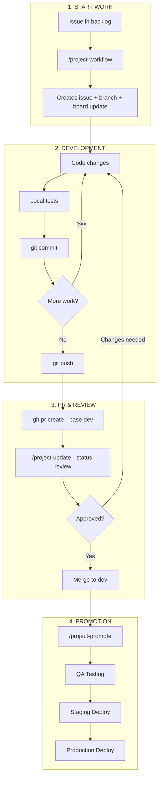
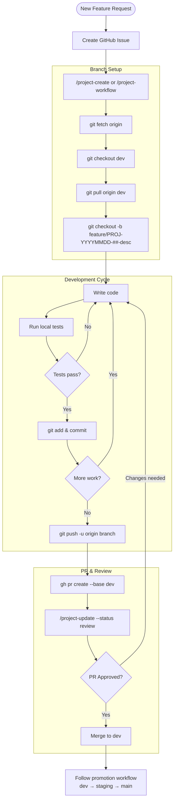
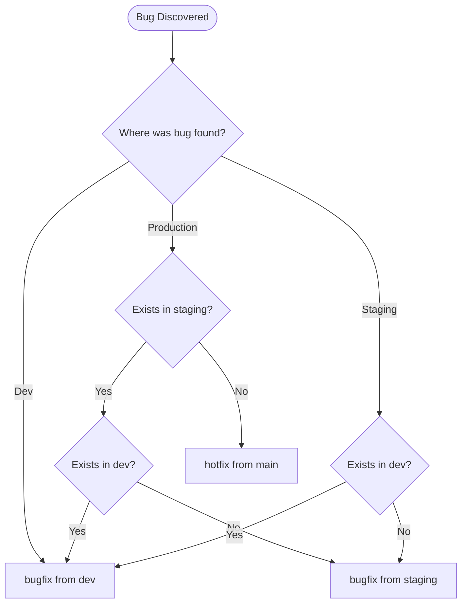
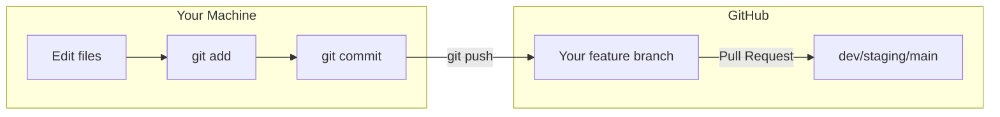

# Claude Code Workflow Guide

A practical guide to developing with Claude Code on Windows. This workflow uses PowerShell, Anaconda, and git worktrees to let you work on multiple issues simultaneously while Claude handles the heavy lifting.

---

## How It Works

This workflow automates the entire development cycle: from creating well-structured GitHub issues, through implementation, to PR review and merge. The key insight is that **configuration syncs via Dropbox** while **local setup is minimal**.



### Choosing Your Implementation Path



| Path | When to Use | Command |
|------|-------------|---------|
| **Simple task** | Quick fixes, one task at a time, small changes | `cc` then `/work 15` |
| **Complex/parallel work** | Long-running tasks, multiple issues, isolated testing | `ccw 15` (creates worktree + runs `/work 15`) |

---

## Part 1: Setup

Setup is split into two parts:
- **Dropbox files** sync automatically across all your machines
- **Local files** need to be created once per machine

### Prerequisites

Install these tools first:

| Tool | Installation | Purpose |
|------|--------------|---------|
| **Anaconda** | [anaconda.com](https://www.anaconda.com/download) | Python environment management |
| **Node.js** | [nodejs.org](https://nodejs.org/) | Required for Claude Code |
| **GitHub CLI** | `winget install GitHub.cli` | Interact with GitHub from terminal |
| **Claude Code** | `npm install -g @anthropic-ai/claude-code` | The AI coding assistant |
| **VS Code** | [code.visualstudio.com](https://code.visualstudio.com/) | Code editor |
| **posh-git** | `Install-Module posh-git -Scope CurrentUser` | Shows git branch in prompt |

After installing GitHub CLI, authenticate:
```powershell
gh auth login
```

### Step 1: Get the Dropbox Files

The workflow functions and slash commands live in Dropbox and sync automatically:

```
~/ProtoGen Dropbox/Adam Morse/
├── claude-workflow.md          # This document
├── claude-aliases.ps1          # PowerShell functions (cc, ccw, prv, etc.)
└── .claude/
    └── commands/
        ├── issues.md           # /issues slash command
        ├── work.md             # /work slash command
        ├── startup.md          # /startup slash command
        └── closedown.md        # /closedown slash command
```

**If you're setting up a new machine**, ensure Dropbox is installed and these files are synced before proceeding.

### Step 2: Create Your PowerShell Profile

The PowerShell profile tells your terminal where to find the workflow functions.

Create this file at `C:\Users\<YOUR_USERNAME>\Documents\WindowsPowerShell\Microsoft.PowerShell_profile.ps1`:

```powershell
# PowerShell Profile - Sources workflow from Dropbox
# This file stays on local machine; workflow functions sync via Dropbox

# Git branch in prompt (shows current branch like: ~/Documents/myrepo [main])
Import-Module posh-git -ErrorAction SilentlyContinue

# Abbreviate home directory as ~ in prompt
$GitPromptSettings.DefaultPromptAbbreviateHomeDirectory = $true

# Source Claude workflow functions from Dropbox
$claudeAliases = "$env:USERPROFILE\ProtoGen Dropbox\Adam Morse\claude-aliases.ps1"
if (Test-Path $claudeAliases) {
    . $claudeAliases
}

# Auto-activate conda env from environment.yml on directory change
function Set-LocationWithCondaActivate {
    param([string]$Path)

    if ($Path) {
        Microsoft.PowerShell.Management\Set-Location $Path
    }

    # Check for environment.yml in new directory
    if (Test-Path "environment.yml") {
        $envContent = Get-Content "environment.yml" -Raw
        if ($envContent -match "name:\s*(.+)") {
            $envName = $Matches[1].Trim()
            if ($env:CONDA_DEFAULT_ENV -ne $envName) {
                conda activate $envName 2>$null
                if ($LASTEXITCODE -eq 0) {
                    Write-Host "Activated: $envName" -ForegroundColor DarkGray
                }
            }
        }
    }
}

# Override cd to use our function
Set-Alias -Name cd -Value Set-LocationWithCondaActivate -Option AllScope -Force

# Also run on startup for current directory
Set-LocationWithCondaActivate
```

### Step 3: Create the Slash Commands Symlink

Claude Code looks for custom commands in `~/.claude/commands/`. We create a symlink so it finds our Dropbox commands.

**Run PowerShell as Administrator** and execute:

```powershell
# Create .claude directory if it doesn't exist
New-Item -ItemType Directory -Path "$env:USERPROFILE\.claude" -Force

# Create symlink to Dropbox commands
New-Item -ItemType SymbolicLink `
    -Path "$env:USERPROFILE\.claude\commands" `
    -Target "$env:USERPROFILE\ProtoGen Dropbox\Adam Morse\.claude\commands"
```

> **Why a symlink?** When we update slash commands in Dropbox, every machine gets the update automatically. Without the symlink, you'd have to copy files to each machine manually.

### Step 4: Configure MCP Servers (Optional but Recommended)

MCP (Model Context Protocol) servers give Claude access to external tools and documentation. We use several:

| Server | Purpose | How to Add |
|--------|---------|------------|
| **holoviz** | Panel, hvPlot documentation | `claude mcp add holoviz -- cmd /c uvx holoviz-mcp` |
| **context7** | General library documentation | `claude mcp add context7 --transport http --url https://mcp.context7.com/mcp` |
| **playwright** | Browser automation for testing | `claude mcp add playwright -- cmd /c npx @playwright/mcp@latest` |

**To add an MCP server:**
```powershell
# Example: Add the holoviz documentation server
claude mcp add holoviz -- cmd /c uvx holoviz-mcp

# Verify it's connected
claude mcp list
```

The servers are stored in `~/.claude.json` and persist across sessions.

### Step 5: Configure VS Code (Recommended)

To use Anaconda PowerShell as your VS Code terminal, add to VS Code settings (`Ctrl+,` → Open Settings JSON):

```json
{
    "terminal.integrated.defaultProfile.windows": "Anaconda PowerShell",
    "terminal.integrated.cwd": "C:\\Users\\<YOUR_USERNAME>\\Documents",
    "terminal.integrated.profiles.windows": {
        "Anaconda PowerShell": {
            "source": "PowerShell",
            "args": [
                "-ExecutionPolicy", "ByPass",
                "-NoExit",
                "-Command",
                "& 'C:\\Users\\<YOUR_USERNAME>\\anaconda3\\shell\\condabin\\conda-hook.ps1'; conda activate base"
            ],
            "icon": "terminal-powershell"
        }
    }
}
```

Replace `<YOUR_USERNAME>` with your Windows username.

### Step 6: Configure Windows Terminal (Optional)

If you use Windows Terminal, set the starting directory for Anaconda PowerShell. The settings file is at:
`%LOCALAPPDATA%\Packages\Microsoft.WindowsTerminal_8wekyb3d8bbwe\LocalState\settings.json`

Find the Anaconda profile and update:
```json
{
    "name": "Anaconda PowerShell Prompt (anaconda3)",
    "startingDirectory": "C:\\Users\\<YOUR_USERNAME>\\Documents"
}
```

To make it default, copy its `guid` to `defaultProfile` at the top of the file.

### Verify Your Setup

Open a new PowerShell window. You should see:
```
Claude workflow: cc, ccw, ccw-clean, pstop, prv, pr-approve, pr-done
```

If you don't see this message, check that Dropbox has synced and the path in your profile is correct.

---

## Part 2: Usage

### The Complete Workflow

Here's the typical flow for working on a feature:

```
┌──────────────────────────────────────────────────────────────────────────┐
│ 1. CREATE AN ISSUE                                                       │
│    ──────────────────                                                    │
│    cd ~/Documents/myrepo                                                 │
│    cc                              # Launch Claude Code                  │
│    > /issues Add a dark mode toggle to the settings page                 │
│                                                                          │
│    Claude researches the repo, checks for duplicates, and creates        │
│    a well-structured GitHub issue with acceptance criteria.              │
└──────────────────────────────────────────────────────────────────────────┘
                                    │
                                    ▼
┌──────────────────────────────────────────────────────────────────────────┐
│ 2. IMPLEMENT THE FEATURE                                                 │
│    ─────────────────────                                                 │
│                                                                          │
│    Option A: Simple task (stay in current directory)                     │
│    ─────────────────────────────────────────────────                     │
│    > /work 15                      # Claude implements issue #15         │
│                                                                          │
│    Option B: Complex task or multitasking (use worktree)                 │
│    ─────────────────────────────────────────────────────                 │
│    ccw 15                          # Creates isolated worktree,          │
│                                    # launches Claude with /work 15       │
│                                                                          │
│    Claude reads the issue, creates a branch, implements the feature,     │
│    runs tests, and creates a PR.                                         │
└──────────────────────────────────────────────────────────────────────────┘
                                    │
                                    ▼
┌──────────────────────────────────────────────────────────────────────────┐
│ 3. VERIFY THE PR                                                         │
│    ─────────────                                                         │
│    prv 15                          # Checkout PR, activate env, install  │
│    myapp                           # Run the application                 │
│    # ... test in browser ...                                             │
└──────────────────────────────────────────────────────────────────────────┘
                                    │
                                    ▼
┌──────────────────────────────────────────────────────────────────────────┐
│ 4. MERGE AND CLEAN UP                                                    │
│    ─────────────────                                                     │
│    pstop                           # Stop any running servers            │
│    pr-done 15                      # Approve, merge, delete branch,      │
│                                    # clean up worktree, return to main   │
└──────────────────────────────────────────────────────────────────────────┘
```

---

### Command Reference

#### `cc` - Launch Claude Code

Launches Claude Code in "permissionless" mode where it can execute commands and edit files without asking for confirmation each time.

```powershell
cd ~/Documents/myrepo
cc
```

Use this when you want to:
- Run slash commands like `/issues`, `/work`, `/startup`
- Have a conversation with Claude about your code
- Do quick tasks without the worktree overhead

---

#### `/issues` - Create a GitHub Issue

**Run inside Claude Code** to create a well-structured GitHub issue.

```
/issues Add a DatePicker widget that supports a "disabled" parameter
```

What it does:
1. Checks for duplicate issues
2. Researches the repository's conventions
3. Looks up relevant documentation via MCP servers
4. Creates an issue with acceptance criteria and code references
5. Gives you the `gh` command to publish it

**Tier-aware behavior:** For `protogen-org/*` repos, prompts you to select a workflow tier:
- **Tier 1 (Production)**: Full research + adds to GitHub Projects board
- **Tier 2 (Team Dev)**: Full research, no board integration
- **Tier 3 (Personal)**: Streamlined research, basic issue format

External repos skip tier selection and follow the target repo's conventions.

---

#### `/work` - Implement an Issue

**Run inside Claude Code** to implement a GitHub issue autonomously.

```
/work 15
```

What it does:
1. Reads the issue details from GitHub
2. Creates a feature branch (if not already on one)
3. Implements the changes following the acceptance criteria
4. Runs tests
5. Creates a pull request

**When to use `/work` directly:**
- Quick fixes or small features
- You're only working on one thing at a time
- The task will complete in one session

---

#### `ccw <issue#>` - Work in a Worktree

Sets up an isolated copy of your repo for working on an issue, then launches Claude Code.

```powershell
cd ~/Documents/myrepo
ccw 15
```

What it does:
1. Fetches issue title from GitHub
2. Creates a new branch: `feature/myrepo-15-add-dark-mode`
3. Creates a worktree at: `~/Documents/worktrees/myrepo-issue15/`
4. Copies your `.env` files to the worktree
5. Launches Claude Code with `/work 15`

**When to use `ccw` instead of `/work`:**
- Long-running implementations
- You want to work on multiple issues in parallel
- You want to keep your main repo clean while experimenting

**Worktree structure:**
```
~/Documents/worktrees/
├── sandbox_dash-issue12/
├── sandbox_dash-issue15/
├── circuit_viz-issue8/
└── batch_reopt-issue3/
```

---

#### `prv [pr#]` - Verify a PR

Prepares a PR for manual verification by checking it out and setting up the environment.

```powershell
prv              # List all open PRs
prv 15           # Checkout and prepare PR #15
```

What it does:
1. Shows PR title and files changed
2. Checks out the PR (or switches to its worktree if one exists)
3. Activates the conda environment from `environment.yml`
4. Runs `pip install -e .` to install the package in editable mode
5. Shows you the command to run the application

**Why does it run `pip install -e .` if `environment.yml` already installed the package?**

Good question! When you checkout a different branch (especially in a worktree), the editable install still points to wherever the environment was originally created. Running `pip install -e .` re-points it to the current directory's code, so you're actually testing the PR's changes.

**Running the Dashboard:**

After `prv` completes, use the **Makefile shortcuts** for fast development:

```powershell
# Run full dashboard with hot reload (recommended)
make serve

# Or run individual tabs for fast iteration
make serve-bills      # ProtoGen Dashboard - Bills tab only
make serve-circuit    # Circuit Viz - Circuit tab only
make serve-urdb       # Sandbox Dash - URDB tab only

# See all available commands
make help
```

Alternatively, use the console script created by the editable install:
```powershell
pg_dash          # ProtoGen Dashboard (port 5006)
batch_reopt      # Batch ReOpt (port 5009)
circuit-viz      # Circuit Viz (port 5008)
sandbox_dash     # Sandbox Dash (port 5007)
```

---

#### `pstop` - Stop Running Servers

Kills any running Panel/dashboard server processes.

```powershell
pstop
```

Use this before merging or when you need to free up the port.

---

#### `pr-done <pr#>` - Merge and Clean Up

The final step: approve, merge, and clean everything up.

```powershell
pr-done 15
```

What it does:
1. Cleans up the worktree (if one exists)
2. Approves the PR (skipped if it's your own)
3. Merges with squash
4. Deletes the remote branch
5. Returns you to `main` and pulls latest

---

#### `ccw-clean` - Clean Up Worktrees

Manage your worktrees when you need to clean up.

```powershell
ccw-clean -List              # Show all worktrees
ccw-clean 15                 # Remove worktree for issue #15
ccw-clean -All               # Remove ALL worktrees
ccw-clean -All -Repo myrepo  # Remove all worktrees for a specific repo
```

---

#### `/startup` - Start of Day

**Run inside Claude Code** to get oriented for the day.

```
/startup
```

Shows you:
- GitHub notifications needing attention
- PRs awaiting your review
- Your open PRs and their status
- Assigned issues
- Work in progress (uncommitted changes, unpushed commits)
- Prioritized action list

---

#### `/closedown` - End of Day

**Run inside Claude Code** to wrap up your work.

```
/closedown
```

Shows you:
- Uncommitted changes across repos
- Unpushed commits
- PRs needing attention
- Recommendations for what to handle before signing off

---

## Quick Reference

| Command | Where | Description |
|---------|-------|-------------|
| `cc` | Terminal | Launch Claude Code (permissionless mode) |
| `/issues <description>` | Claude Code | Create a GitHub issue |
| `/work <issue#>` | Claude Code | Implement an issue |
| `ccw <issue#>` | Terminal | Create worktree + implement issue |
| `prv` | Terminal | List open PRs |
| `prv <pr#>` | Terminal | Checkout and prepare PR for verification |
| `pstop` | Terminal | Stop running servers |
| `pr-done <pr#>` | Terminal | Merge PR and clean up |
| `ccw-clean -List` | Terminal | List all worktrees |
| `/startup` | Claude Code | Start of day overview |
| `/closedown` | Claude Code | End of day summary |

---

## Bug Origin Decision

When fixing a bug, the key question is: **which branch should I create the fix from?**



### Quick Reference Table

| Bug Found In | Exists in Staging? | Exists in Dev? | Create From | Merge Flow |
|--------------|-------------------|----------------|-------------|------------|
| Production   | No                | -              | main (hotfix) | main→staging→dev |
| Production   | Yes               | No             | staging (bugfix) | staging→main + cherry-pick dev |
| Production   | Yes               | Yes            | dev (bugfix) | dev→staging→main |
| Staging      | -                 | No             | staging (bugfix) | staging→main + cherry-pick dev |
| Staging      | -                 | Yes            | dev (bugfix) | dev→staging→main |

**Key Principle:** Always fix in the OLDEST branch where the bug exists, then merge forward.

---

## Understanding Commits, Pushes, and Pull Requests

A common misconception: "Some of us use pull requests, others commit and push." These aren't different approaches—they're sequential steps in the same workflow.



### The Three Steps

| Step | What It Does | Where | Analogy |
|------|--------------|-------|---------|
| **Commit** | Saves a snapshot of changes with a message | Local only | Saving a document |
| **Push** | Uploads commits to GitHub | Local → Remote | Uploading to cloud storage |
| **Pull Request** | Requests review and merge into another branch | GitHub | Submitting for approval |

**Key Insight:** Pushing does NOT merge anything. It only uploads your commits to your branch on GitHub. A Pull Request is a separate step that requests someone review and merge your branch into another branch.

### Why This Matters

- Without a PR, your pushed code sits on your feature branch—visible but not integrated
- PRs enable code review, discussion, and CI/CD checks before merging
- Some repos allow direct pushes to main (Tier 3 personal repos), others require PRs (Tier 1 production repos)

### When Each Happens

| Action | When You Do It |
|--------|----------------|
| Commit | After completing a logical unit of work (frequently, even multiple times per hour) |
| Push | When you want your work backed up on GitHub or ready for others to see |
| Pull Request | When your feature/fix is complete and ready for review and integration |

---

## Git Commands Reference

### Before Starting Any Work

```bash
# 1. Fetch latest from remote
git fetch origin

# 2. Check your current branch
git branch

# 3. Switch to main/dev and pull latest
git checkout main
git pull origin main
```

### Creating a Feature Branch

```bash
# From the correct base branch (dev for features, main for hotfixes)
git checkout dev
git pull origin dev
git checkout -b feature/PROJ-YYYYMMDD-##-description

# Push and set upstream
git push -u origin feature/PROJ-YYYYMMDD-##-description
```

### Creating a Pull Request

```bash
# Option 1: Using gh CLI (recommended)
gh pr create --base dev --title "Your PR title" --body "Description"

# Option 2: Using GitHub web UI
# Go to repo → Pull requests → New pull request
# Select base branch (dev/staging/main) and compare branch (your feature)
```

### Checking Branch Status

```bash
# See what commits are in your branch but not in main
git log origin/main..HEAD --oneline

# See what's different between branches
git diff origin/main..HEAD --stat
```

### Merging a PR (after approval)

```bash
# Using gh CLI
gh pr merge <PR#> --squash --delete-branch

# Or merge via GitHub UI, then delete local branch
git branch -d feature/PROJ-YYYYMMDD-##-description
```

### Deleting Branches

```bash
# Delete local branch (safe - only if merged)
git branch -d branch-name

# Delete local branch (force - even if not merged)
git branch -D branch-name

# Delete remote branch
git push origin --delete branch-name
```

### Cherry-picking (for hotfixes)

```bash
# After merging hotfix to main, apply to staging and dev
git checkout staging
git pull origin staging
git cherry-pick <commit-sha>
git push origin staging

git checkout dev
git pull origin dev
git cherry-pick <commit-sha>
git push origin dev
```

---

## Dashboard Development Workflow

All ProtoGen Panel dashboards follow a standardized development workflow using Makefiles and panel serve entry points.

### Standard Makefile Commands

Every dashboard repository includes a Makefile with these standard targets:

```powershell
make help           # Show all available commands
make install        # Install package in editable mode (pip install -e .)
make serve          # Run full dashboard with hot reload
make serve-<tab>    # Run individual tab for fast iteration
make test           # Run test suite
make clean          # Remove build artifacts and caches
make compile        # Update requirements.txt from pyproject.toml (uses uv)
```

### Console Script Entry Points

After running `make install` (or `pip install -e .`), each dashboard installs a console script:

| Dashboard | Console Script | Port | Repository |
|-----------|---------------|------|------------|
| ProtoGen Dashboard | `pg_dash` | 5006 | `dash` |
| Sandbox Dash | `sandbox_dash` | 5007 | `sandbox_dash` |
| Circuit Viz | `circuit-viz` | 5008 | `circuit_viz` |
| Batch ReOpt | `batch_reopt` | 5009 | `batch_reopt` |

**Example workflow:**
```powershell
# Navigate to dashboard repo
cd ~/Documents/batch_reopt

# Install in editable mode (one time)
make install

# Run full dashboard
make serve
# Or equivalently: batch_reopt

# Run individual tab for fast iteration
make serve-systembuilder
# Or with panel serve directly:
# panel serve src/batch_reopt/dashboard/systembuilder_tab.py --dev --show
```

### Fast Iteration with Individual Tabs

When working on a specific tab, serve it individually for faster reload times:

**Sandbox Dash** - Multiple entry points for each major tab:
```powershell
make serve-urdb          # URDB Testbed tab (port 5008)
make serve-interval      # Interval Data tab (port 5009)
make serve-pv            # Load vs PV tab (port 5010)
make serve-version       # Version Compare tab (port 5011)

# Or use console scripts directly
urdb_tab
interval_data_tab
```

**ProtoGen Dashboard** - Individual tabs:
```powershell
make serve-bills         # Bills tab
make serve-interval      # Interval data tab
make serve-status        # Project status tab
make serve-scenarios     # Scenarios tab
make serve-admin         # Admin tab
```

**Circuit Viz** - Circuit tab:
```powershell
make serve-circuit       # Circuit visualization tab
```

### App Structure

All dashboards follow this entry point pattern:

```
src/<package_name>/
├── app.py                    # Main entry point with main() function
├── dashboard/
│   ├── tab1.py              # Can be served individually
│   ├── tab2.py              # Can be served individually
│   └── ...
└── ...
```

**app.py pattern:**
```python
def main():
    """Console script entry point."""
    pn.serve(
        {"Dashboard": create_dashboard},
        port=5006,
        show=True,
        title="Dashboard Title",
    )

if __name__ == "__main__":
    main()
```

**Individual tab pattern (for fast iteration):**
```python
# In dashboard/my_tab.py
class MyTabBackend(param.Parameterized):
    """Tab state and logic."""
    pass

class MyTabFrontend(pn.viewable.Viewer):
    """Tab UI layout."""
    def __panel__(self):
        return pmui.Column(...)

def main():
    """Entry point for standalone tab serving."""
    backend = MyTabBackend()
    frontend = MyTabFrontend(state=backend)
    return frontend

if __name__ == "__main__" or __name__.startswith("bokeh"):
    pn.serve({"Tab": main}, show=True, port=5008)
```

### Development Tips

1. **Use `make serve` during implementation** - Full dashboard with hot reload gives you complete context
2. **Use `make serve-<tab>` for iteration** - Faster reload when polishing a specific tab
3. **Use console scripts for verification** - Quick way to test the installed entry point works correctly
4. **Always run `make install` after pulling changes** - Ensures your editable install is current

---

## Troubleshooting

### `pip install` fails with "WinError 32"
A server is still running and holding a file lock:
```powershell
pstop
pip install -e .
```

### Conda not activating in VS Code
Verify the path to conda in your VS Code settings matches your Anaconda installation.

### Symlink creation fails
You must run PowerShell **as Administrator** to create symlinks on Windows.

### Functions not loading
Check that Dropbox is synced:
```powershell
Test-Path "$env:USERPROFILE\ProtoGen Dropbox\Adam Morse\claude-aliases.ps1"
```

### MCP server not connecting
Check server status:
```powershell
claude mcp list
```

If a server shows as disconnected, try removing and re-adding it:
```powershell
claude mcp remove holoviz
claude mcp add holoviz -- cmd /c uvx holoviz-mcp
```
y
